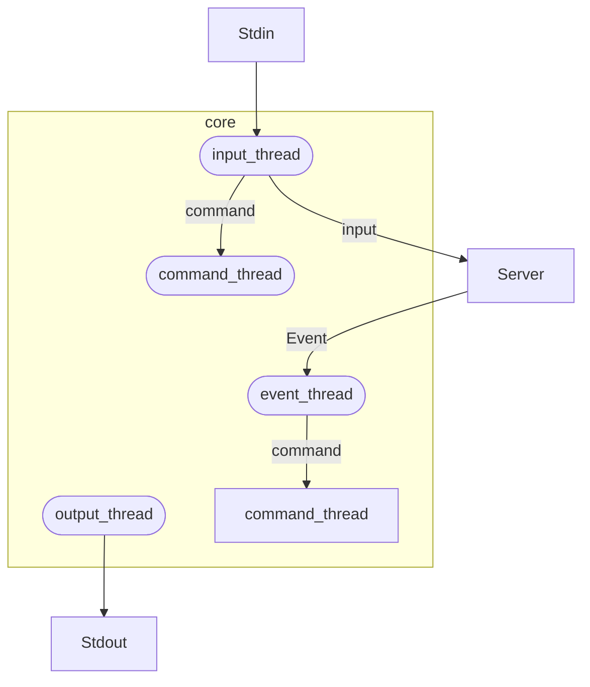

目前 Core 的jia'gou

```mermaid
flowchart

subgraph core
	it([input_thread])
    ct([command_thread])
    et([event_thread])
    ot([output_thread])
    
    et --command--> command_thread
end

Stdin --> it
it --input--> Server
it --command--> ct

Server --Event--> et

ot --> Stdout
```

