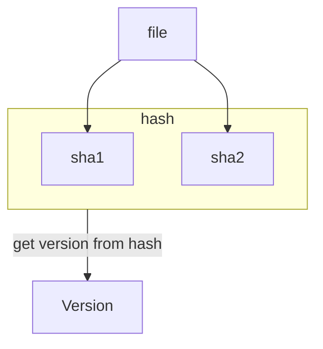

- Project
    - `slug` / `ID`：唯一标识
    - `project_type`：`mod` / `modpack` / `resourcepack` / `shader`
    - `versions`：version IDs

- Version
    - `name`
    - `version_number`：semantic versioning
    - `game_versions`：支持的游戏版本列表（字符串数组）
    - `version_type`：`release` / `beta` / `alpha`
    - `loaders`：支持的加载器列表（字符串数组）
    - `files`：VersionFiles
- VersionFile
    - `hashes`
    - `url`
    - `filename`
    - `primary`：每个版本最多只有一个 Primary 文件，如果没有，可以推测第一个是

